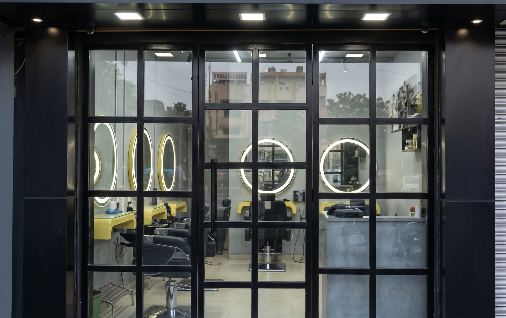

# Sai Darshan Salon

> Premium Unisex Salon & Hair Studio located in Dindoli, Surat, Gujarat.



## Overview

Sai Darshan Salon is a modern, responsive website built with vanilla HTML5, CSS3, and JavaScript. The studio delivers precision haircuts, master fades, hot towel straight-razor shaves, signature hair protein therapy, Parisian balayage, and luxury hair care.

- **Location**: Shop No 15, Dream Shoppers, opp. Dindoli Police Station, Tirupati Society, Dindoli, Surat, Gujarat 394210
- **Phone / WhatsApp**: [+91 96622 81908](tel:+919662281908)
- **Hours**: Open Daily: 08:00 AM – 12:00 AM Midnight

## Features

- **Dual-Wing Unisex Showcase**: Dedicated zones for The Women's Atelier and The Men's Barber Lounge.
- **BarberMate Interactive Hero**: Dual-card slideshow with auto-advance, arrow controls, and vertical dot indicators.
- **Framer-Style Split Contact Stage**: Sleek dark overlapping reservation card and embedded Google Maps.
- **Full SEO & Structured Data**: Complete JSON-LD schemas (`HairSalon`, `FAQPage`, `OfferCatalog`), OpenGraph, `robots.txt`, and `sitemap.xml`.
- **Ultra-Lightweight & Fast**: Zero heavy JavaScript frameworks; pure vanilla performance.
- **100% Mobile Responsive**: Tested from 320px up to 4K desktop viewports with zero horizontal overflow.

## Tech Stack

- **HTML5** & **Semantic Elements**
- **CSS3** (Custom Properties, Flexbox, Grid, Fluid `clamp()`)
- **Vanilla JavaScript** (IIFE Encapsulation, IntersectionObserver, requestAnimationFrame)

## Getting Started

1. Clone this repository:
   ```bash
   git clone https://github.com/IleshDevX/SaiDarshan.git
   cd SaiDarshan
   ```

2. Open `index.html` in your browser or run a local static server:
   ```bash
   npx serve .
   ```

## License

© Sai Darshan Salon. All rights reserved.
